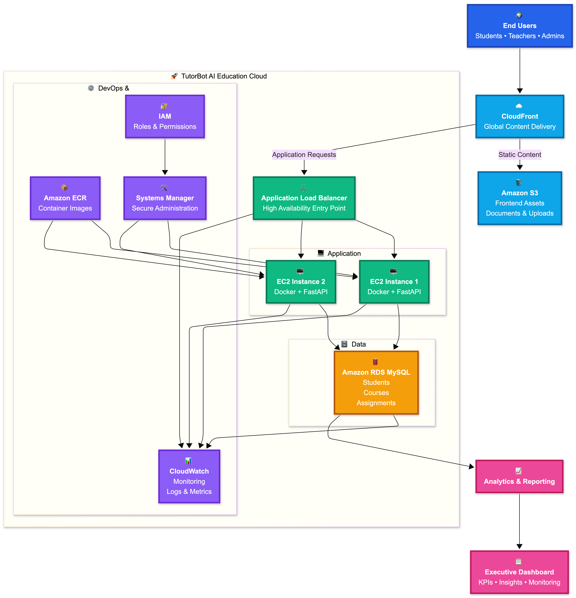
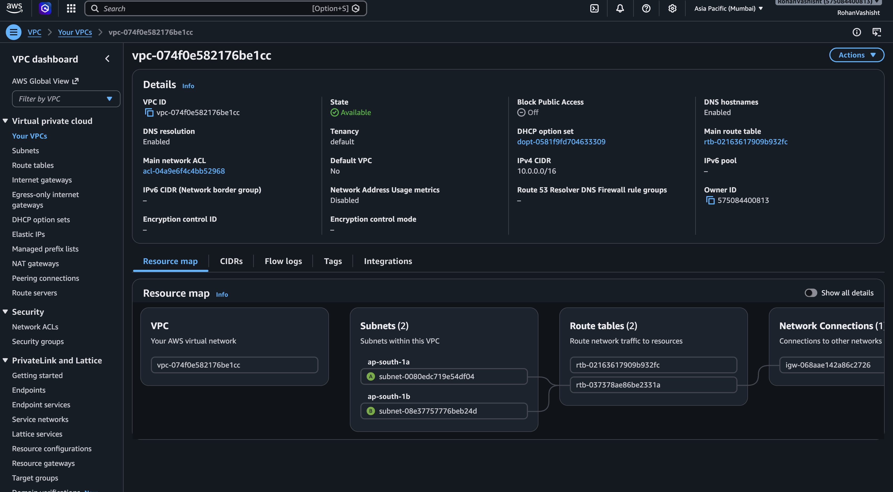
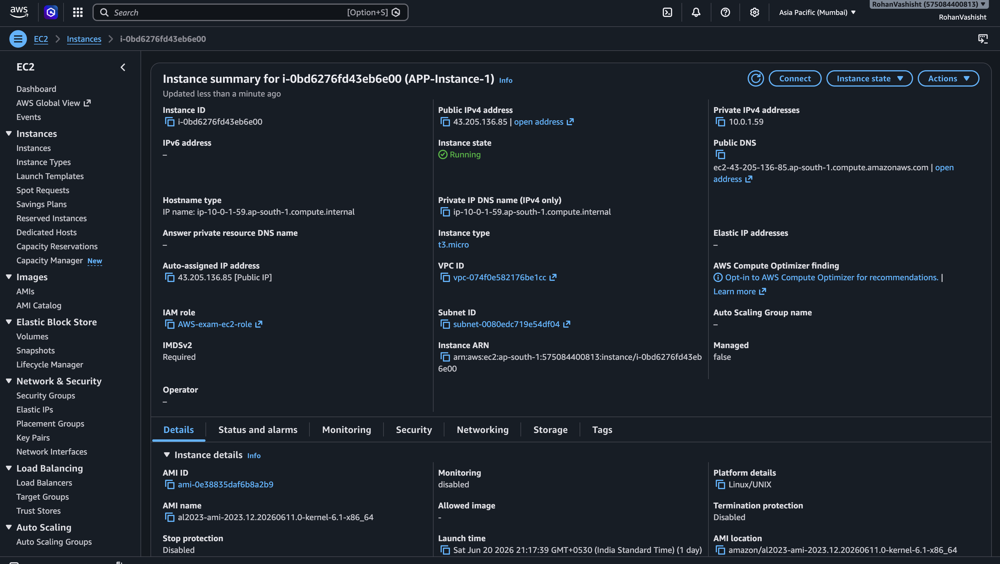
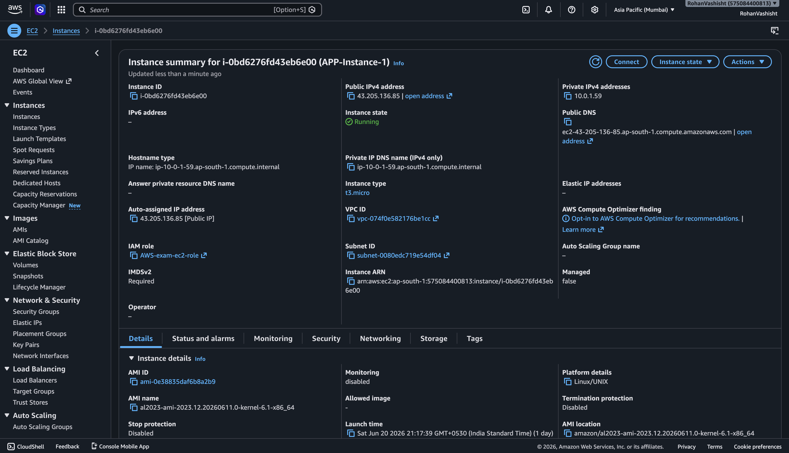
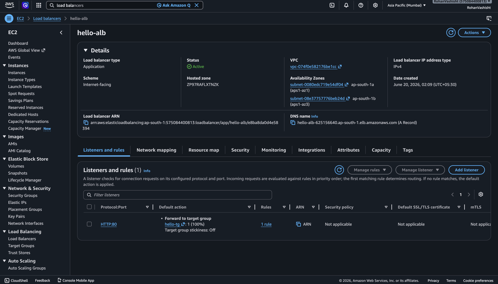
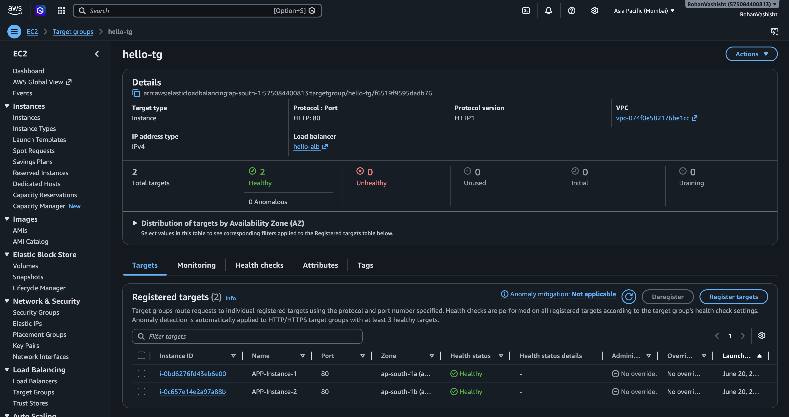
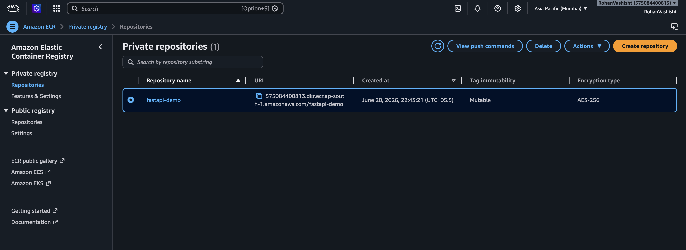
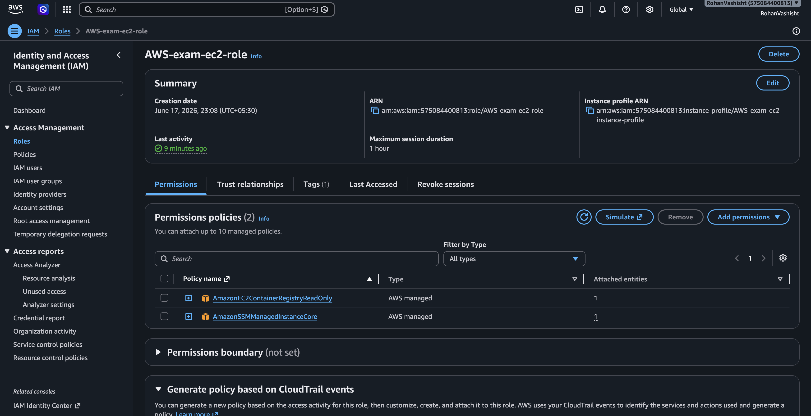
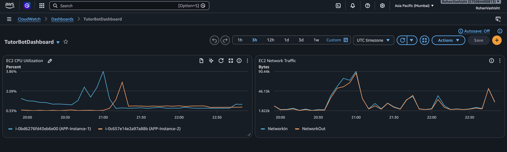
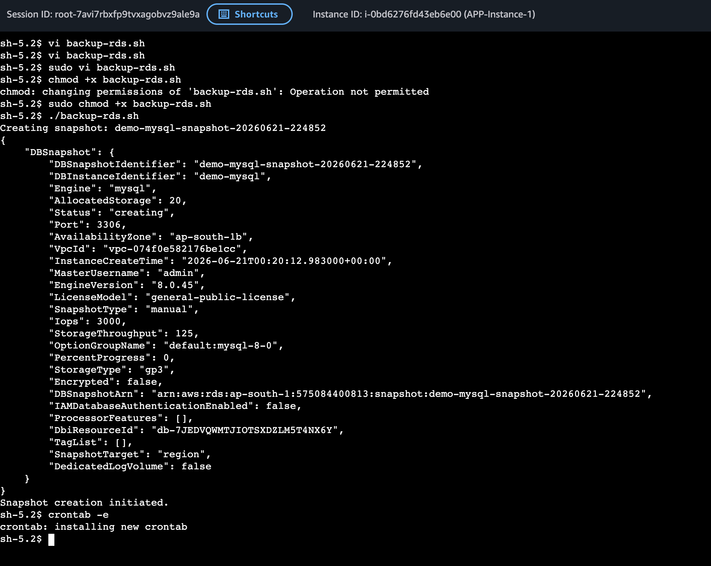

# TutorBot AI Education Cloud

## AWS Cloud Engineering Case Study

### B.Tech CSE 2024–2028

### ITM Skills University

---

# Project Overview

TutorBot AI Education Cloud is a cloud-native educational management platform designed to demonstrate enterprise cloud engineering concepts using AWS.

The project addresses the challenge of managing educational operations through a centralized, scalable, secure, and highly available cloud platform.

The implementation focuses on:

* Cloud Infrastructure Design
* Linux Administration
* Docker Containerization
* AWS Networking
* Database Management
* Monitoring & Logging
* Automation
* Cost Optimization
* Operational Dashboards
* Role-Based Access Control

The primary objective is not application complexity but demonstrating practical cloud computing concepts and AWS service integration.

---

# Problem Statement

TutorBot AI Education Cloud is experiencing rapid growth across multiple operational regions. Existing operations rely on disconnected systems, spreadsheets, manual workflows, and isolated reporting environments.

The organization requires:

* Centralized operational management
* Secure access control
* Reporting and analytics
* Monitoring and observability
* Disaster recovery readiness
* Scalability for future growth
* High availability architecture
* Cloud-native deployment practices

---

# Solution Architecture

The platform was designed using AWS services following modern cloud deployment best practices.

## Architecture Components

### Edge Layer

* CloudFront
* Amazon S3

### Compute Layer

* Application Load Balancer
* EC2 Instance 1
* EC2 Instance 2

### Application Layer

* FastAPI Backend
* Docker Containers

### Data Layer

* Amazon RDS MySQL

### Monitoring Layer

* Amazon CloudWatch
* CloudWatch Dashboards
* CloudWatch Alarms

### Security Layer

* IAM Roles
* Security Groups
* AWS Systems Manager

### Container Registry

* Amazon ECR

---

# High Level Architecture

```
Internet Users
        │
        ▼
 CloudFront CDN
        │
 ┌──────┴──────┐
 │             │
 ▼             ▼
S3         Load Balancer
                │
        ┌───────┴────────┐
        ▼                ▼
     EC2-1            EC2-2
  Docker App       Docker App
        │                │
        └──────┬─────────┘
               ▼
          Amazon RDS
               │
               ▼
         CloudWatch
```

---

# AWS Infrastructure Implemented

## Networking

### VPC

Dedicated Virtual Private Cloud created for TutorBot.

### Subnets

* Public Subnet A
* Public Subnet B

### Internet Gateway

Provides internet connectivity.

### Route Tables

Configured for public subnet routing.

### Security Groups

Application Security Group:

* HTTP 80
* SSH / SSM Access

Database Security Group:

* MySQL 3306
* Restricted to application servers

---

# Compute Infrastructure

## EC2 Instance 1

Purpose:

* FastAPI Application
* Docker Runtime

Responsibilities:

* Serve API Requests
* Process Application Logic

---

## EC2 Instance 2

Purpose:

* High Availability
* Load Balancer Target

Responsibilities:

* Serve API Requests
* Redundancy

---

# Load Balancer

Application Load Balancer configured to:

* Distribute traffic
* Improve availability
* Support scaling
* Route requests to healthy instances

Health Checks:

* `/health`

---

# Database Layer

## Amazon RDS MySQL

Used for:

* Student Records
* Courses
* Assignments
* Enrollments
* Authentication Data

Advantages:

* Managed Backups
* Automated Maintenance
* High Availability Ready
* Monitoring Integration

---

# Backend Technology Stack

## FastAPI

Features:

* REST API
* Authentication
* Role-Based Access
* Dashboard Metrics
* Reporting APIs

---

## Database ORM

* SQLAlchemy

---

## Validation

* Pydantic

---

## Environment Management

* Python Dotenv

---

# Backend Features

## Authentication

Mock Login System

Roles:

* Teacher
* Student

Credentials:

```
Username: user
Password: 1234
```

Teacher Capabilities:

* Manage Students
* Manage Courses
* Create Assignments
* Generate Reports

Student Capabilities:

* View Courses
* View Assignments
* Access Dashboard

---

# API Modules

## Authentication

* Login
* Current User

## Students

* Create
* Read
* Update
* Delete

## Courses

* Create
* Read
* Update
* Delete

## Assignments

* Create
* Read

## Enrollments

* Create
* Read

## Reports

* Summary Reports

## Monitoring

* Health Check
* Metrics
* Dashboard Statistics

---

# Frontend Technology Stack

## React

Single Page Application

## TypeScript

Type Safe Development

## Vite

Fast Build Tool

## Recharts

Analytics Visualizations

## React Router

Routing

---

# Frontend Features

## Login Portal

Role Selection:

* Teacher
* Student

---

## Dashboard

Displays:

* Students
* Courses
* Enrollments
* Assignments

---

## Student Management

* Add Students
* Edit Students
* Delete Students

---

## Course Management

* Add Courses
* Edit Courses
* Delete Courses

---

## Assignment Management

* Create Assignments
* View Assignments

---

## Reporting Dashboard

* KPI Overview
* Operational Metrics
* System Statistics

---

## Cloud Health Dashboard

Displays:

* Application Status
* Database Status
* Monitoring Information

---

# Docker Implementation

## Backend Container

FastAPI application packaged using Docker.

Benefits:

* Portability
* Consistency
* Simplified Deployment

---

# Container Registry

## Amazon ECR

Used for:

* Storing Docker Images
* Version Management
* Deployment Source

---

# Monitoring & Observability

## Amazon CloudWatch

Implemented:

### Metrics

* CPU Utilization
* Network Usage
* Memory Monitoring
* Application Health

### Dashboards

* Infrastructure Metrics
* Resource Utilization
* Operational Visibility

### Alarms

* Threshold Monitoring
* Performance Alerts

---

# Linux Administration

Implemented Concepts:

## User Management

* IAM Integration
* Systems Manager Access

## Process Monitoring

* Docker Containers
* Application Processes

## Log Monitoring

* Application Logs
* System Logs

## Service Management

* Docker Runtime
* EC2 Services

---

# Automation

## Backup Automation

Automated RDS Snapshot Script

Purpose:

* Disaster Recovery
* Data Protection

Features:

* Timestamped Snapshots
* Automated Scheduling

---

## Cron Jobs

Implemented for:

* Backup Scheduling
* Maintenance Tasks

---

# Security Implementation

## IAM

Configured:

* EC2 Roles
* ECR Access
* CloudWatch Access
* Systems Manager Access

---

## Security Groups

Application Security:

* Controlled HTTP Access

Database Security:

* Restricted MySQL Access

---

## Systems Manager

Secure Administration Without SSH Exposure

Benefits:

* Improved Security
* Centralized Management

---

# Disaster Recovery Strategy

## Database

Amazon RDS Snapshots

Recovery Process:

1. Create Snapshot
2. Restore Database
3. Reconnect Application

---

## Application

Docker Images Stored In ECR

Recovery Process:

1. Launch New EC2
2. Pull Container
3. Start Application

---

# Scalability Design

Current Architecture:

* 2 EC2 Instances
* Load Balancer
* Managed Database

Future Expansion:

* Auto Scaling Groups
* Multi-AZ Database
* Multi-Region Deployment
* WAF Integration
* CI/CD Pipelines

---

# Cost Optimization

Implemented Strategies

### Compute

* Right-sized EC2 instances

### Database

* Managed RDS

### Storage

* S3 Static Hosting

### CDN

* CloudFront Caching

### Monitoring

* Essential Metrics Only

### Containers

* Lightweight Docker Images

---

# Estimated Monthly Cost

| Service                   | Estimated Cost (USD/Month) |
| ------------------------- | -------------------------- |
| 2 EC2 Instances           | $16                        |
| Application Load Balancer | $18                        |
| Amazon RDS MySQL          | $15                        |
| Amazon S3                 | $2                         |
| CloudFront                | $2                         |
| Amazon ECR                | $1                         |
| CloudWatch                | $3                         |
| Data Transfer             | $3                         |
| Total                     | ~$60                       |

Approximate Monthly Cost:

### $55 – $65 USD/month

Educational workloads and low traffic usage.

---

# Repository Structure

```text
.
├── README.md
├── backend
│   ├── Dockerfile
│   ├── README.md
│   ├── __pycache__
│   │   └── main.cpython-314.pyc
│   ├── app
│   │   ├── __pycache__
│   │   │   └── main.cpython-314.pyc
│   │   └── main.py
│   ├── pyproject.toml
│   └── uv.lock
├── frontend
│   ├── README.md
│   ├── deno.lock
│   ├── index.html
│   ├── node_modules
│   │   ├── @types
│   │   ├── @vitejs
│   │   ├── lucide-react -> .deno/lucide-react@0.454.0/node_modules/lucide-react
│   │   ├── react -> .deno/react@18.3.1/node_modules/react
│   │   ├── react-dom -> .deno/react-dom@18.3.1/node_modules/react-dom
│   │   ├── react-router-dom -> .deno/react-router-dom@6.30.4/node_modules/react-router-dom
│   │   ├── recharts -> .deno/recharts@2.15.4/node_modules/recharts
│   │   ├── typescript -> .deno/typescript@5.9.3/node_modules/typescript
│   │   └── vite -> .deno/vite@5.4.21/node_modules/vite
│   ├── package.json
│   ├── src
│   │   ├── App.tsx
│   │   ├── api.ts
│   │   ├── auth.tsx
│   │   ├── components
│   │   │   ├── AppShell.tsx
│   │   │   ├── ConfirmDialog.tsx
│   │   │   ├── Header.tsx
│   │   │   ├── Modal.tsx
│   │   │   ├── Sidebar.tsx
│   │   │   └── StatCard.tsx
│   │   ├── main.tsx
│   │   ├── pages
│   │   │   ├── AssignmentsPage.tsx
│   │   │   ├── CloudHealthPage.tsx
│   │   │   ├── CoursesPage.tsx
│   │   │   ├── DashboardPage.tsx
│   │   │   ├── LoginPage.tsx
│   │   │   ├── ReportsPage.tsx
│   │   │   ├── StudentsPage.tsx
│   │   │   └── SystemDesignPage.tsx
│   │   ├── styles.css
│   │   ├── types.ts
│   │   └── vite-env.d.ts
│   ├── tsconfig.json
│   ├── tsconfig.tsbuildinfo
│   └── vite.config.ts
└── screenshots
    ├── archietcture_diagram.png
    ├── cloudwatch dashboard.png
    ├── cron.png
    ├── ec2_instance_1.png
    ├── ec2_instance_2.png
    ├── ecr.png
    ├── load_balancer.png
    ├── role.png
    ├── target group.png
    └── vpc_and_subnets.png
```

---

# Screenshots

## Architecture Diagram



## VPC and Subnets



## EC2 Instance 1



## EC2 Instance 2



## Load Balancer



## Target Group



## Amazon ECR



## IAM Role



## CloudWatch Dashboard



## Automation Cron Job



---

# Learning Outcomes

This project demonstrates:

* AWS Infrastructure Design
* VPC Networking
* EC2 Administration
* Load Balancing
* Docker Containerization
* Amazon ECR
* Amazon RDS
* Amazon S3
* CloudFront
* IAM Security
* CloudWatch Monitoring
* Linux Administration
* Shell Automation
* Cost Optimization
* Disaster Recovery Planning
* Full Stack Cloud Deployment

---
